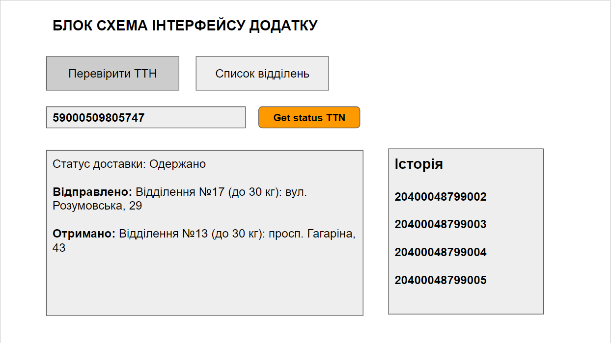

# Тестове завдання NovaPoshta :muscle: :wave:

Цей додаток - тестове завдання для демонстрації навичок програмування на мові
JavaScript та використання бібліотеки React.

Це завдання є простим та зручним додатком, який дозволяє користувачам
відстежувати свої посилки, відправлені через компанію доставки Нова Пошта. За
допомогою кількох кліків користувачі можуть швидко перевірити статус та деталі
доставки своїх посилок без необхідності навігації по веб-сайту Нової Пошти і
отримати інформацію про розташування відділень Нової пошти в різних містах
України.

## :star: ЗАВДАННЯ З РОБОТОЮ API НОВОЇ ПОШТИ

Документація API: https://developers.novaposhta.ua/documentation

Порядок роботи:

1. Зареєструватися на сайті Нової пошти та згенерувати ключ після входу за
   адресою https://new.novaposhta.ua/dashboard/settings/developers

2. Знайти зі списку документації запити для пошуку актуального статусу
   місцезнаходження посилки за номером накладної та отримання списку відділень
   Нової пошти

3. Адреси для API запитів: https://api.novaposhta.ua/v2.0/json/

ВИМОГИ ДО ФУНКЦІОНАЛУ

1. Користувач вводить номер ТТН або свій номер накладної в поле введення на
   сторінці.
2. Додаток відправляє запит на отримання даних про актуальний статус місця
   доставки товару.
3. Виводимо інформацію про відправку користувачеві.
4. Користувач повинен бачити всі попередні номери ТТН у вигляді списку в
   сайтбарі. Навіть після перезавантаження сторінки.
5. По кліку на вже доданий до списку введених номер ТТН повинен автоматично бути
   виконаний запит на статус знаходження товару (доставки) і виведена відповідна
   інформація. При цьому номер ТТН повинен автоматично відображатися в полі
   введення.
6. Номер ТТН накладної обов'язково повинен бути перевірений при введенні на
   коректність заповнення. Або засобами порівняння кожного символа з потрібним
   діапазоном кодування або регулярним виразом.
7. Повинна бути можливість очистити всі старі ТТН.
8. При невірному форматі після натискання на кнопку отримати статус доставки
   ТТН, обов'язково повинна бути показана підказка і запит відправлятися не
   повинен.
9. Переходячи на другу вкладку, користувач повинен мати можливість побачити
   список відділень Нової пошти, для чого потрібно зробити відповідний запит до
   API Нової пошти і вивести їх списком на свій розсуд.

## :exclamation: Як запустити додаток:

1. Клонуйте репозиторій на свій комп'ютер за допомогою команди:

git clone https://github.com/Daniel-Slavnyi/news-test-task.git

2. Встановіть залежності, виконавши команду:

npm install

3. Запустіть додаток, виконавши команду:

npm start

Додаток буде доступний за адресою http://localhost:3000/.

# Використані технології та бібліотеки

1. JavaScript
2. React
3. React Router
4. Redux/toolkit
5. React-i18next
6. Redux-persist
7. Mui/material
8. Axios
9. Formik
10. Yup
11. React-Toastify

# Автор

Цей додаток створений Данилом Славним в рамках тестового завдання. Контактна
інформація:

- Email: dslavnyj00@gmail.com
- LinkedIn: https://www.linkedin.com/in/danylo-slavnyi/
